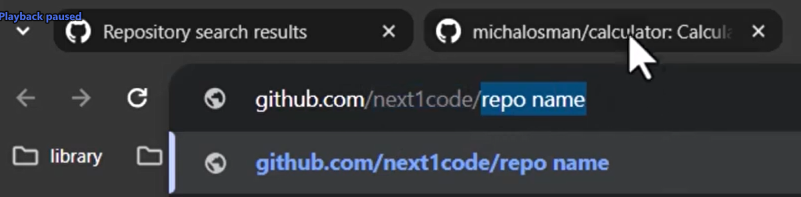

# h1 - How's your life?

Lorem ipsum dolor sit amet, consectetur adipiscing elit, sed do eiusmod tempor incididunt ut labore et dolore magna aliqua. Egestas purus viverra accumsan in nisl nisi. Arcu cursus vitae congue mauris

## h2 - Nothing much

گزاشتن لینک

click here to see my github [meee](https://github.com/amin-dev3232/test)

### h3 - Take care

---

خط افقی

گزاشتن عکس



**bold text**

_italic text_

> Lorem ipsum dolor sit amet, consectetur adipiscing elit, sed do eiusmod tempor incididunt ut labore et dolore magna aliqua. Egestas purus viverra accumsan in nisl nisi. Arcu cursusLorem ipsum dolor sit amet, consectetur adipiscing elit, sed do eiusmod tempor incididunt ut labore et dolore magna aliqua. Egestas purus viverra accumsan in nisl nisi. Arcu cursus

---

- hi mu dasda
- hi mu dasda
- hi mu dasda
  - hi mu dasda
  - hi mu dasda
- hi mu dasda

---

my code `function getProduct(req, res, next) {
  Product.fetchAll((products) => {
    res.render('shop', {
      products,
      pageTitle: 'Shop'
    });
  });
}`

---

```javascript
function getProduct(req, res, next) {
  Product.fetchAll((products) => {
    res.render('shop', {
      products,
      pageTitle: 'Shop',
    });
  });
}
```

---

```html
<!doctype html>
<html lang="en">
  <head>
    <meta charset="UTF-8" />
    <meta name="viewport" content="width=device-width, initial-scale=1.0" />
    <title>Git - Github</title>
  </head>
  <body></body>
</html>
```

---

| یک جدول | حوشگل |
| ------- | ----- |
| یی      | ییی   |
| یی      | ییی   |
| یی      | ییی   |
